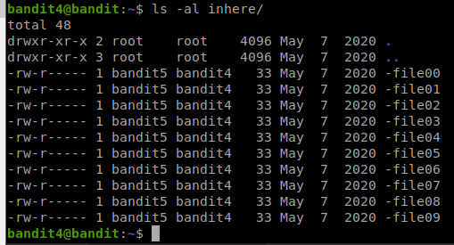
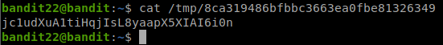
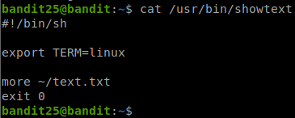

# OverTheWire Bandit

## Introduction

Hi everyone, welcome to the first post of RethinkSec.

Today, I will share on the basic of the Linux command. In Cybersecurity world, Linux is one of the most used OS that will be used by the industry. For penetration testing, we will normally recommend Kali Linux / Parrot Security OS. You may easily search on how to install this OS online. I will recommend using a VMware Player / Oracle VirtualBox (both are free) for you to have this OS installed.

Before we learn about cybersecurity, Linux is one of the most key ability that we need to be ready before we can move further. OverTheWire Bandit is one of the best resources that you can use to learn about it. You can ssh to the environment, and you learn the command on the go. Your objective is simple, which is find the next level password. The username is known, which are "bandit" with the level number, such as "bandit0", "bandit1" and so on.

First, we need to ssh into the environment. We can login with the command below:

```ssh bandit0@bandit.labs.overthewire.org -p 2220```

| Command                     | Description                                                    |
| --------------------------- | -------------------------------------------------------------- |
| ssh                         | SSH toolkit for you to remote access to the target environment |
| bandit0                     | Username of the server / host                                  |
| bandit.labs.overthewire.org | Hostname                                                       |
| -p 2220                     | Specify the port number (Port 22 is the default port for SSH)  |


First time you may see a message such as "The authenticity of host can’t be established…  Are you sure you want to continue connecting?" For this message, you just type "yes" (without quote), then it will ask for the password, which is "bandit0".

## Level 0 > Level 1

| Info     | Description                                          |
| -------- | ---------------------------------------------------- |
| Host     | bandit.labs.overthewire.org                          |
| Port     | 2220                                                 |
| Username | bandit0                                              |
| Password | bandit0                                              |
| URL      | https://overthewire.org/wargames/bandit/bandit1.html |

The objective for Level 0 to Level 1 is we need to know the content of the file "readme" which is located in the home directory, and the file content will be the password for "bandit1". For us to read the file content of a file, we can run ```cat <filename>```. In this case, we will need to run ```cat readme```.

We can see the password is >!boJ9jbbUNNfktd78OOpsqOltutMc3MY1, then we can exit, and reinitiate another SSH login as "bandit1" now, with the new password.


Key takeaway:
- We learnt about how to remote access to the environment via SSH
- We can read the file content with "cat" command.

## Level 1 > Level 2

| Info     | Description                                          |
| -------- | ---------------------------------------------------- |
| Host     | bandit.labs.overthewire.org                          |
| Port     | 2220                                                 |
| Username | bandit1                                              |
| Password | boJ9jbbUNNfktd78OOpsqOltutMc3MY1                     |
| URL      | https://overthewire.org/wargames/bandit/bandit2.html |

The objective for Level 1 to Level 2 is we need to know the content of the file "-" which is located in the home directory, and the file content will be the password for "bandit2". "-" is one of the special character in Linux environment, where it is widely used by multiple environment. For example, "cd -" will bring you to the previous directory. In order for us to cat the file with the name "-", we can add a "./" before it, which means the current directory. "./-" means that the filename of "-" which is within the current directory. If you want to read the file that is from the parent directory, use "../" instead.


We can see the password for bandit2 is ```CV1DtqXWVFXTvM2F0k09SHz0YwRINYA9```, and we proceed with the next user.

Key takeaway:
- "-" is one of the special characters in Linux environment.

## Level 2 > Level 3

| Info     | Description                                          |
| -------- | ---------------------------------------------------- |
| Host     | bandit.labs.overthewire.org                          |
| Port     | 2220                                                 |
| Username | bandit2                                              |
| Password | CV1DtqXWVFXTvM2F0k09SHz0YwRINYA9                     |
| URL      | https://overthewire.org/wargames/bandit/bandit3.html |

The objective for Level 2 to Level 3 is we need to know the content of the file "spaces in this filename" which is located in the home directory, and the file content will be the password for "bandit3". Space is one of the special characters where it will treat the space as a separator between commands & parameters. For example, "cat readme" means that "cat" the file with the filename "readme". So for us to read the actual file content for it, we have 2 ways to work on it.

The first way is to add a backslash in front of every space, the backslash is to tell the command that treat the space as the character itself, and do not interpret to something else. The second way is to add a double quote between the filename, so the command knows this are referring to the same thing.


We can see the password is ```UmHadQclWmgdLOKQ3YNgjWxGoRMb5luK```, and we proceed with the next user.

Key takeaway:
- Space is one of the special characters in Linux environment, we can use either backslash or quote around the file name, so the environment knows we are talking 1 file instead of multiple files

## Level 3 > Level 4

| Info     | Description                                          |
| -------- | ---------------------------------------------------- |
| Host     | bandit.labs.overthewire.org                          |
| Port     | 2220                                                 |
| Username | bandit3                                              |
| Password | UmHadQclWmgdLOKQ3YNgjWxGoRMb5luK                     |
| URL      | https://overthewire.org/wargames/bandit/bandit4.html |

The objective for Level 3 to Level 4 is we need to know the content of a hidden file which is located in the "inhere" directory, and the file content will be the password for "bandit4". In Linux environment, in order for us to hide a file, we can simply put a dot in front of the file. So "readme" and ".readme" are different, where one of the is visible, and another one is not visible.

In order for us to list out all the hidden file, we can use ls -al
| Command | Description                                   |
| ------- | --------------------------------------------- |
| ls      | List command                                  |
| -a      | All files including hidden files / directory  |
| -l      | List the files & directories in a list format |


We can see if the command without "-a", it will only show those file that are not hidden. The password for bandit4 is ```pIwrPrtPN36QITSp3EQaw936yaFoFgAB```

Key takeaway:
- "." is one of the special characters in Linux environment, where it will hide the file / directory so it will not show the hidden file / directory without the "-a" flag.

## Level 4 > Level 5

| Info     | Description                                          |
| -------- | ---------------------------------------------------- |
| Host     | bandit.labs.overthewire.org                          |
| Port     | 2220                                                 |
| Username | bandit4                                              |
| Password | pIwrPrtPN36QITSp3EQaw936yaFoFgAB                     |
| URL      | https://overthewire.org/wargames/bandit/bandit5.html |

The objective for Level 4 to Level 5 is we need to know the content of a file which is located in the "inhere" directory, and only one of the file will only contain a specific human-readable word and it will be the password for "bandit4". If we are using "cat" to read the content, then our terminal will messed up with gibberish data.



We have 2 ways to get around with this.
- Read the file content using the strings command.


- Read the file information before we read the file using file command


From both command above, we can see only "inhere/-file07" contain ASCII text, and the password for user bandit5 is ```koReBOKuIDDepwhWk7jZC0RTdopnAYKh```

We can also see that I used "\*" for both command. "\*" in bash means all files in the directory, it is a shortcut for us to deal with all files instead of typing them 1 by 1.

Key takeaway:
- file can be used to identify the file to see whether if the file is a text file, executable file, or others file (normally named as data)
- strings can be used to read all the file contents that are human-readable only.

## Level 5 > Level 6

| Info     | Description                                          |
| -------- | ---------------------------------------------------- |
| Host     | bandit.labs.overthewire.org                          |
| Port     | 2220                                                 |
| Username | bandit5                                              |
| Password | koReBOKuIDDepwhWk7jZC0RTdopnAYKh                     |
| URL      | https://overthewire.org/wargames/bandit/bandit6.html |

The objective for Level 5 to Level 6 is to find a file somewhere under the inhere directory that meet the requirement below:
- Human-readable
- 1033 bytes in size
- Not executable

Since there are multiple requirements, we can use find command to help us with it.

```find inhere -size 1033c ! -executable -exec file {} + | grep text```

We can split this command into few parts:
| Command                      | Description                                                                                          |
| ---------------------------- | ---------------------------------------------------------------------------------------------------- |
| find inhere                  | invoke find command based on inhere directory                                                        |
| -type f                      | Specify our result should be a file, instead of directory                                            |
| -size 1033c                  | Specify the size as 1033 bytes                                                                       |
| ! -executable                | Specify the file is not executable                                                                   |
| -exec file {} + \| grep text | Will ask the find command to run file command to identify the file type, and grab the keyword "text" |

Now we can see the result as below:


Now we can see the password for bandit 6 is ```DXjZPULLxYr17uwoI01bNLQbtFemEgo7```

Key takeaway:
- Find command can be very useful when we are required to find a certain file with conditions
- We can ask the find command to run a specific command for us.

## Level 6 > Level 7

| Info     | Description                                          |
| -------- | ---------------------------------------------------- |
| Host     | bandit.labs.overthewire.org                          |
| Port     | 2220                                                 |
| Username | bandit6                                              |
| Password | DXjZPULLxYr17uwoI01bNLQbtFemEgo7                     |
| URL      | https://overthewire.org/wargames/bandit/bandit7.html |

The objective for Level 6 to Level 7 are similar, where we need to find a file from the entire file system that meet the requirement below:
- Owned by user bandit7
- Owned by group bandit6
- 33 bytes in size

We can use the find command again to find the file and meet the requirement:

```find / -type f -user bandit7 -group bandit6 -size 33c 2>/dev/null```

We can split this command into few parts
| Command        | Description                                                                                                                                                       |
| -------------- | ----------------------------------------------------------------------------------------------------------------------------------------------------------------- |
| find /         | invoke find command based on file system.                                                                                                                         |
| -type f        | Specify our result should be a file, instead of directory                                                                                                         |
| -user bandit7  | Specify the owned by user bandit7                                                                                                                                 |
| -group bandit6 | Specify the file is owned by group bandit6                                                                                                                        |
| -size 33c      | Specify the file size as 33 bytes                                                                                                                                 |
| 2>/dev/null    | Redirect all the gibberish information (such as permission denied) to /dev/null (which is a null device in Linux system, and will discard whatever written to it) |

Now we can see the result as below:


The password for bandit7 is ```HKBPTKQnIay4Fw76bEy8PVxKEDQRKTzs```.

Key takeaway:
- We can use the find command to specify the ownership for user & group.

## Level 7 > Level 8

| Info     | Description                                          |
| -------- | ---------------------------------------------------- |
| Host     | bandit.labs.overthewire.org                          |
| Port     | 2220                                                 |
| Username | bandit7                                              |
| Password | HKBPTKQnIay4Fw76bEy8PVxKEDQRKTzs                     |
| URL      | https://overthewire.org/wargames/bandit/bandit8.html |

The next challenge is fairly simple, we need to find our password that is sit next to keyword millionth from a huge file named data.txt.

We can use a nice tool called grep (we used it at Level 5 > Level 6) to grab our specific keyword. We can run the command below

```cat data.txt | grep millionth```

The output will be similar as below


We can see the password for bandit8 is ```cvX2JJa4CFALtqS87jk27qwqGhBM9plV```.

Key takeaway:
- Grep can be useful when we just want to get the line with specific keyword.

## Level 8 > Level 9

| Info     | Description                                          |
| -------- | ---------------------------------------------------- |
| Host     | bandit.labs.overthewire.org                          |
| Port     | 2220                                                 |
| Username | bandit8                                              |
| Password | HKBPTKQnIay4Fw76bEy8PVxKEDQRKTzs                     |
| URL      | https://overthewire.org/wargames/bandit/bandit9.html |

The next challenge required us to find the password from a huge file that is occured once. We can use 2 utilities, called sort and uniq to help us accomplish the task. We can run the command below

cat data.txt | sort | uniq -u

We can split this command into few parts
| Command      | Description                                   |
| ------------ | --------------------------------------------- |
| cat data.txt | Show all the content of data.txt              |
| \|           | Redirect the output as the next command input |
| sort         | Sort the output in an alphabetical order      |
| uniq -u      | Show only the unique lines                    |


Why we must use sort? Because system will only compare the lines before and after the specific line. In other word, they cannot detect there are duplicate if the duplicated text are scattering everywhere.

We can see from the image below, the original content has a total of 1001 lines of text. If we are not sorting them, and just find the unique lines, then it will shows 991 lines, instead of 1 line only.


So the password for bandit9 is ```UsvVyFSfZZWbi6wgC7dAFyFuR6jQQUhR```

Key takeaway:
- We can use sort to sort the file content by lines, it is very useful when we want to sort out the randomise information
- We can use uniq to find out the uniq lines of the file content.

## Level 9 > Level 10

| Info     | Description                                           |
| -------- | ----------------------------------------------------- |
| Host     | bandit.labs.overthewire.org                           |
| Port     | 2220                                                  |
| Username | bandit9                                               |
| Password | UsvVyFSfZZWbi6wgC7dAFyFuR6jQQUhR                      |
| URL      | https://overthewire.org/wargames/bandit/bandit10.html |

The challenge is similar to the previous, where our password is now near with character "=". But the files may contain characters that are not human-readable. So instead of "cat", we use "strings" instead.

```strings data.txt | grep =```


From the image above, we can see the password for bandit10 is ```truKLdjsbJ5g7yyJ2X2R0o3a5HQJFuLk```

Key takeaway:
- We can use multiple tools that we used previously in a single challenge!

## Level 10 > Level 11

| Info     | Description                                           |
| -------- | ----------------------------------------------------- |
| Host     | bandit.labs.overthewire.org                           |
| Port     | 2220                                                  |
| Username | bandit10                                              |
| Password | truKLdjsbJ5g7yyJ2X2R0o3a5HQJFuLk                      |
| URL      | https://overthewire.org/wargames/bandit/bandit11.html |

In this challenge, we need to base64 decode a string, which can be our password for next level. In linux, there is an utility called base64 which allow us to encode / decode base64 string.

We can login to the environment, and get the base64 content, and pipe it for base64 utitlity to decode.


The -d parameters means "decode", if you want to encode the string, simply remove the parameter and it will encode the string to base64 output.

We can now see the password for bandit11 is ```IFukwKGsFW8MOq3IRFqrxE1hxTNEbUPR```.

Key takeaways:
- We can use base64 utility to encode / decode a string.

## Level 11 > Level 12

| Info     | Description                                           |
| -------- | ----------------------------------------------------- |
| Host     | bandit.labs.overthewire.org                           |
| Port     | 2220                                                  |
| Username | bandit11                                              |
| Password | IFukwKGsFW8MOq3IRFqrxE1hxTNEbUPR                      |
| URL      | https://overthewire.org/wargames/bandit/bandit12.html |

In this level, we need to decode a string, that has been rotated by 13 positions, means "A" is now switch to "N", and vice versa. This is a famous cipher called "Caesar Cipher", which it use the rotation to encode the actual string.

We can first get the content of the data.txt, then we can put it to online decoder to sort it out. There are multiple website which can solve this.


We can see the data.txt content is gibberish, but if we put it to online decoder to decode it, we can see the actual content.


We can see the actual password is ```5Te8Y4drgCRfCx8ugdwuEX8KFC6k2EUu```.

Key Takeaways:
- There are multiple ciphers that are used in the past, including Caesar Cipher, Vigenere Cipher, Subsitution Cipher etc.

## Level 12 > Level 13

| Info     | Description                                           |
| -------- | ----------------------------------------------------- |
| Host     | bandit.labs.overthewire.org                           |
| Port     | 2220                                                  |
| Username | bandit12                                              |
| Password | 5Te8Y4drgCRfCx8ugdwuEX8KFC6k2EUu                      |
| URL      | https://overthewire.org/wargames/bandit/bandit13.html |

In this challenge, we need to decompress a file which is compressed multiple times with different utilities. In Linux, there are multiple compression tools, including tar, bzip, gzip, 7z, zip etc. Among these compressions method, the most common methods are tar & gzip.

After we login, we can see the data.txt is a hexdump of a file. We can use a utility called xxd, to convert the hexdump to a proper file.


To avoid the file has been altered, we can copy this file to temporary directory (/tmp) and we can do our stuff there. Note that it is very important to change your mode to 777 as this temporary directory is going to be useful for upcoming challenges as well.


Next, we will use xxd to convert the hexdump to a proper file, then we can check the file type of the output file.


We can see the output file is a gzip compressed data. We can rename it with the extension ".gz", so we will not going to confuse the gzip utility. To uncompress a gzip compressed data, we can use gunzip.


To rename a file, we use mv command, which stands for move a file. We can use this to rename a file also. After we gunzip the file, we can see the file is now a bzip2 compressed data, which has an extension of "bz2", and we can use "bunzip2" to decompress it.


After the decompression, we can see now it is a gzip file again, and after we gunzip it again, we can now see a new compression method, which is "tar".


For tar, we need to use tar utility to decompress it, we can use ```tar xvf <file name>``` to decompress the file.


We can see instead of replace the zip file to a normal file (like what bzip2 & gzip did), it will create a new file, which is based on the compressed content. Let’s continue the journey.


After multiple decompression, we can now see the password is ```8ZjyCRiBWFYkneahHwxCv3wb2a1ORpYL```.

Key takeaways:
- There are multiple compression method in Linux.
- We can use xxd to convert a hexdump to a normal file.

## Level 13 > Level 14

| Info     | Description                                           |
| -------- | ----------------------------------------------------- |
| Host     | bandit.labs.overthewire.org                           |
| Port     | 2220                                                  |
| Username | bandit13                                              |
| Password | 8ZjyCRiBWFYkneahHwxCv3wb2a1ORpYL                      |
| URL      | https://overthewire.org/wargames/bandit/bandit14.html |

In this challenge, we will learn a new method of SSH. On all the previous level, we are always use password to authenticate ourselves. But SSH also provide another possibility for authentication, which is using public / private key method. This method will be useful when you are not comfortable to share your account password to others, but they need to remote to your environment to perform some stuff.

We will need to login via SSH with private key, and then we need to get the password from the specific directory (/etc/bandit_pass/bandit14), which is readable by bandit14 only.

Firstly, we need to copy the private key to our temporary directory.


We should also need to ensure that the private key should not have any access for others. If you have a permission that is allows the group / others have the permission, then you will get the error below:


So now we can SSH with the private key provided to bandit14, and read the file content:


You can also see that I am using localhost as my target, this is because we are SSH to the same machine. For the network connection that is between the same host, we will use localhost to tell the system that I want to talk back to the same system.

We can now see the password is ```4wcYUJFw0k0XLShlDzztnTBHiqxU3b3e```.

Key takeaways:
- We can use private key to login via SSH also.

## Level 14 > Level 15

| Info     | Description                                           |
| -------- | ----------------------------------------------------- |
| Host     | bandit.labs.overthewire.org                           |
| Port     | 2220                                                  |
| Username | bandit14                                              |
| Password | 4wcYUJFw0k0XLShlDzztnTBHiqxU3b3e                      |
| URL      | https://overthewire.org/wargames/bandit/bandit15.html |

In this challenge, we need to supply our own password to a specific port and we will get the next password. To connect to a port, we can use nc utility, which stands for netcat.

We need to connect to port 30000, and we will get the response as the next level password.


Do we have a one-liner way? Of course! Just echo our password first, and pipe it to nc, it will works too!


Easy! Now we get the password for bandit15 which is ```BfMYroe26WYalil77FoDi9qh59eK5xNr```.

Key takeaways:
- We can use nc to connect to a remote host with specific port.

## Level 15 > Level 16

| Info     | Description                                           |
| -------- | ----------------------------------------------------- |
| Host     | bandit.labs.overthewire.org                           |
| Port     | 2220                                                  |
| Username | bandit15                                              |
| Password | BfMYroe26WYalil77FoDi9qh59eK5xNr                      |
| URL      | https://overthewire.org/wargames/bandit/bandit16.html |

In this challenge, we need to supply our own password to a specific port and we will get the next password just like last level. However, we will need to initiate the connection with SSL / TLS connection! In the last level (Level 14 > Level 15), nc utility will only perform the non-encrypted connection. In order for us to do this, we can use the other utility called OpenSSL. OpenSSL is a robust, commercial-grade, and full-featured toolkit for the Transport Layer Security (TLS) and Secure Sockets Layer (SSL) protocols. It is also a general-purpose cryptography library. Inside OpenSSL tookit, there is a specific function called s_client, which will allow us to initiate SSL / TLS encrypted connection.

We can run the following command, and OpenSSL will perform all the necessary key exchange.

```openssl s_client -connect localhost:30001```

The output will be similar as below:


So now we can insert our current password, and the password for next level will shown.


1-liner ways? Of course!

```echo "BfMYroe26WYalil77FoDi9qh59eK5xNr" | openssl s_client -ign_eof -connect localhost:30001```


So we can see I have included additional parameter, which is ```-ign_eof```, which is basically tell the OpenSSL not to close the connection once everything is clear, so it allow some time for the socket to return the response, instead of close the connection after it is done.

Now we can get our password for bandit16 is ```cluFn7wTiGryunymYOu4RcffSxQluehd```

Key takeaways:
- We can perform a TLS / SSL encryption connection to ensure that our connection is secured.

## Level 16 > Level 17

| Info     | Description                                           |
| -------- | ----------------------------------------------------- |
| Host     | bandit.labs.overthewire.org                           |
| Port     | 2220                                                  |
| Username | bandit16                                              |
| Password | cluFn7wTiGryunymYOu4RcffSxQluehd                      |
| URL      | https://overthewire.org/wargames/bandit/bandit17.html |

For this level, we will need to perform 3 tasks
- Identify which ports are open from the range of 31000-32000
- Identify which of them require SSL / TLS connection
- Only 1 of them will show the next level password

We can use nmap to identify all 3 characteristics at the same time. We can run the ```-sV``` flag to identify the service and version information.


From here we can there are total of 5 ports are opened, which are 31046, 31518, 31691, 31790, 31960. Among these 5 ports, only 31790 will be our target, and the rest will be just echo on what we have input.

So use the same command as the previous level, and we can get the password.

```echo "cluFn7wTiGryunymYOu4RcffSxQluehd" | openssl s_client -ign_eof -connect localhost:31790```


Note that in this case, we got the private key for SSH instead of the password. We will use this private key for the next level. Copy it out to our terminal and give it the permission of 400 (read only access for the owner, group & others will have no access on this file).


So let’s SSH into it, and we are in!


Once we got the access, we can get the password for bandit17 from /etc/bandit_pass/bandit17


We can see the password for bandit17 is ```xLYVMN9WE5zQ5vHacb0sZEVqbrp7nBTn```

Key takeaways:
- We can use nmap to identify the services that is running on the ports in range.
- We can perform SSH connection via private key also

## Level 17 > Level 18

| Info     | Description                                           |
| -------- | ----------------------------------------------------- |
| Host     | bandit.labs.overthewire.org                           |
| Port     | 2220                                                  |
| Username | bandit17                                              |
| Password | xLYVMN9WE5zQ5vHacb0sZEVqbrp7nBTn                      |
| URL      | https://overthewire.org/wargames/bandit/bandit18.html |

In this level, we will need to identify the difference between 2 files, passwords.new & passwords.old. In Linux, there is a good utility called diff, which will allow us to identify the difference between these 2 files.


From here, we can see the only difference is at line 42, which ```kfBf3eYk5BPBRzwjqutbbfE887SVc5Yd``` will be our new password for bandit18.

Key takeaways:
- We can use diff to quickly identify the difference between 2 files.

## Level 18 > Level 19

| Info     | Description                                           |
| -------- | ----------------------------------------------------- |
| Host     | bandit.labs.overthewire.org                           |
| Port     | 2220                                                  |
| Username | bandit18                                              |
| Password | kfBf3eYk5BPBRzwjqutbbfE887SVc5Yd                      |
| URL      | https://overthewire.org/wargames/bandit/bandit19.html |

For this level, when we attempt to login as level 18, we get log out immediately after our successful login.


This is because the .bashrc file has kick us out immediately after the successful connection. We can add additional parameter for us to stay with our connection, which is ```-T```. ```-T``` parameter will disable the pseudo-tty function, which will ignore some file during initialization, and .bashrc is one of them. We can see after we have added the ```-T``` parameter, the exit function will stop, and we can execute our command normally (whoami).


So now we can continue with our objective, which is read the readme file content


We can see the password for bandit19 is ```IueksS7Ubh8G3DCwVzrTd8rAVOwq3M5x```

Key takeaways:
- We can add ```-T``` parameter to disable the pseudo-tty function.

## Level 19 > Level 20

| Info     | Description                                           |
| -------- | ----------------------------------------------------- |
| Host     | bandit.labs.overthewire.org                           |
| Port     | 2220                                                  |
| Username | bandit19                                              |
| Password | IueksS7Ubh8G3DCwVzrTd8rAVOwq3M5x                      |
| URL      | https://overthewire.org/wargames/bandit/bandit20.html |

For this level, we will learn about setuid binary. Setuid (SUID) binary will basically allow you to run the program as the owner of the program. One of the typical SUID binary will be sudo (that’s why we need sudo when we need to run something as root).


We can see in this case, we can see there is a binary called bandit20-do, which basically allow us to run the program as bandit20 user. We can use this binary to get the content of bandit20 user’s password.


So we can see the password for bandit20 is ```GbKksEFF4yrVs6il55v6gwY5aVje5f0j```.

Key takeaways:
- SUID binary will allow the user to run the binary as the owner of the binary.

## Level 20 > Level 21

| Info     | Description                                           |
| -------- | ----------------------------------------------------- |
| Host     | bandit.labs.overthewire.org                           |
| Port     | 2220                                                  |
| Username | bandit20                                              |
| Password | GbKksEFF4yrVs6il55v6gwY5aVje5f0j                      |
| URL      | https://overthewire.org/wargames/bandit/bandit21.html |

For this level, we need to run a specific program that is set with SUID also. We will create a netcat session with the password, and use this program to retrieve it, if it got the correct password, then it will give us the next level password


In this case, we will need 2 SSH sessions. The first one will be used to send the password, and the second one will be use to run the suconnect program.


We first will echo our current level password, and pipe it to create a nc session with port 1234, then we open another terminal to run the suconnect to port 1234. Since it got the correct password, then it will get the next level password, which is ```gE269g2h3mw3pwgrj0Ha9Uoqen1c9DGr```.

Key takeaways:
- We can setup our own nc connection, and let others to connect us back.

## Level 21 > Level 22

| Info     | Description                                           |
| -------- | ----------------------------------------------------- |
| Host     | bandit.labs.overthewire.org                           |
| Port     | 2220                                                  |
| Username | bandit21                                              |
| Password | gE269g2h3mw3pwgrj0Ha9Uoqen1c9DGr                      |
| URL      | https://overthewire.org/wargames/bandit/bandit22.html |

In this level, we will learn about crontab. Crontab is basically a job that will run the action on a specific date and time.

In this case, we can see ```/etc/cron.d/cronjob_bandit22``` is running a bash code every second.


Let’s inspect on the bash code.


This bash code will basically input the next level password into this specific file (/tmp/t7O6lds9S0RqQh9aMcz6ShpAoZKF7fgv), which has the content of the next level password, ```Yk7owGAcWjwMVRwrTesJEwB7WVOiILLI```.

Key takeaways:
- Cron job is an useful tool to perform and repeat some task for the administrator on the a certain period.

## Level 22 > Level 23

| Info     | Description                                           |
| -------- | ----------------------------------------------------- |
| Host     | bandit.labs.overthewire.org                           |
| Port     | 2220                                                  |
| Username | bandit22                                              |
| Password | Yk7owGAcWjwMVRwrTesJEwB7WVOiILLI                      |
| URL      | https://overthewire.org/wargames/bandit/bandit23.html |

In this level, we are going to inspect on the cron job again.


In this case, we are gonna understand on the bash code, and let’s analyse it.


| Command                                                         | Description                                                                                     |
| --------------------------------------------------------------- | ----------------------------------------------------------------------------------------------- |
| myname=$(whoami)                                                | this is to run the whoami command, and save the output to myname variable                       |
| mytarget=$(echo I am user $myname \| md5sum \| cut -d ' ' -f 1) | this is going to perform 3 tasks                                                                |
| echo I am user $myname                                          | get the result from myname variable (in this case, it is bandit23), and echo I am user bandit23 |
| \| md5sum                                                       | pipe the output, and perform md5 hash                                                           |
| \| cut -d ' ' -f 1                                              | pipe the output again, and split the result by space, and take the first part of result only.   |

In this case, mytarget variable will be storing value of ```8ca319486bfbbc3663ea0fbe81326349```.

So now we know our target file is at /tmp/8ca319486bfbbc3663ea0fbe81326349, let’s get the result.



We can see the next level password is ```jc1udXuA1tiHqjIsL8yaapX5XIAI6i0n```.

Key takeaways:
- We should know other people’s code when we are debugging or inspecting the code. This is essential when we are performing application penetration testing.

## Level 23 > Level 24

| Info     | Description                                           |
| -------- | ----------------------------------------------------- |
| Host     | bandit.labs.overthewire.org                           |
| Port     | 2220                                                  |
| Username | bandit23                                              |
| Password | jc1udXuA1tiHqjIsL8yaapX5XIAI6i0n                      |
| URL      | https://overthewire.org/wargames/bandit/bandit24.html |

Another cron job level, let’s check the code directly.


Inspecting another bash code, we can see that the script will check the files in /var/spool/bandit24, run the script, and finally delete it.

So let’s create our own shell script now.


We create a shell script, which will get the content from /etc/bandit_pass/bandit24, and pipe the output to port 1234. What we need to do then is copy into that file, and patiently wait for it at port 1234. Do not forget to change the mode to be executable before copy into /var/spool/bandit24.


After a while, then we can see the password for bandit24 is ```UoMYTrfrBFHyQXmg6gzctqAwOmw1IohZ```


Key takeaways:
- We can use other’s shell script to help us accomplish certain tasks.

## Level 24 > Level 25

| Info     | Description                                           |
| -------- | ----------------------------------------------------- |
| Host     | bandit.labs.overthewire.org                           |
| Port     | 2220                                                  |
| Username | bandit24                                              |
| Password | UoMYTrfrBFHyQXmg6gzctqAwOmw1IohZ                      |
| URL      | https://overthewire.org/wargames/bandit/bandit25.html |

In this challenge, we have to perform some attack, called brute force attack, to get our next level password. To accomplish this, we need to use some script. I will use python as example, but eventually all languages should works.


This python script will generate all the possible input, and we will use it to send it to the nc connection, and get the result at another text file. Finally, we sort the file, and get the unique value, eventually we will see the password of bandit25 is ```uNG9O58gUE7snukf3bvZ0rxhtnjzSGzG```


Key takeaways:
- We can always combine the knowledge among the previous level to accomplish a certain objectives.

## Level 25 > Level 26

| Info     | Description                                           |
| -------- | ----------------------------------------------------- |
| Host     | bandit.labs.overthewire.org                           |
| Port     | 2220                                                  |
| Username | bandit25                                              |
| Password | uNG9O58gUE7snukf3bvZ0rxhtnjzSGzG                      |
| URL      | https://overthewire.org/wargames/bandit/bandit26.html |

In this level, the system has provided us the ssh private key to bandit26, but the shell is different than what we were using all this while. We can inspect what is the default shell that the particular user is using from /etc/passwd. /etc/passwd will contain some user information, including the username, the home directory, the default shell etc. From the /etc/passwd, we can see the default shell is not /bin/bash, but /usr/bin/showtext.


Let’s inspect further on /usr/bin/showtext.



What it will do is it will display the content of text.txt using more, and then exit. It basically it means we will not able to login with the normal way. We need some trick to play around with it.

more is a special utility on displaying the file content, where it allows the user to view it lines by lines, instead of showing us the entire content. This is very useful, when we can only deal with keyboard but not the mouse (full terminal, no GUI). It also comes with some handy function, such as running a command within more utility, but we need some tricks to make it happens.

First of all, we will need to minimize our terminal as small as possible.


Then, we login as bandit26 again, and we will get the screen similar to this.


So the screen will be frozen, and waiting for us to press up or down to see the full content, now we can maximize our window again, to ensure our eyes are not hurted, and we need to run some magic here.

Firstly, we will need to type v, and press enter, this will allow us to enter the configuration as vi / vim, then it will shows some results like this.


Next, we can set the temporary shell to /bin/bash, so we can perform our stuff accordingly. Type ```:set shell=/bin/bash```


Next, we need to type in ```:shell```, and we got a proper shell now!


From here, we can get the bandit26 password, which is ```5czgV9L3Xx8JPOyRbXh6lQbmIOWvPT6Z```


But take note that since this level is special, where we will not getting a proper shell, we will need to use this for our next level.

Key takeaways:
- more / less (another similar utility) will allow the attacker to perform privilege escalation on it. For more information, can refer to https://gtfobins.github.io/gtfobins/more/

## Level 26 > Level 27

| Info     | Description                                           |
| -------- | ----------------------------------------------------- |
| Host     | bandit.labs.overthewire.org                           |
| Port     | 2220                                                  |
| Username | bandit26                                              |
| Password | 5czgV9L3Xx8JPOyRbXh6lQbmIOWvPT6Z                      |
| URL      | https://overthewire.org/wargames/bandit/bandit27.html |

In this level, we has a SUID program called "bandit27-do", so we can use this, and get the password for bandit27 like previous level.


Easy! The password is ```3ba3118a22e93127a4ed485be72ef5ea```.

## Level 27 > Level 28

| Info     | Description                                           |
| -------- | ----------------------------------------------------- |
| Host     | bandit.labs.overthewire.org                           |
| Port     | 2220                                                  |
| Username | bandit27                                              |
| Password | 3ba3118a22e93127a4ed485be72ef5ea                      |
| URL      | https://overthewire.org/wargames/bandit/bandit28.html |

Alright, here it comes. The git related challenges! For this challenge, we will need to clone a repository (repo) from another user called "bandit27-git", we can run the command git clone to clone the latest repository into our selected directory.


When we get into the repo directory, we can see there is a README file, which contains our next level password! ```0ef186ac70e04ea33b4c1853d2526fa2```


Key takeaways:
- We can use git clone to clone the latest repository from the server that support git (GitHub, GitLab, Gitea, or even your own git server)

## Level 28 > Level 29

| Info     | Description                                           |
| -------- | ----------------------------------------------------- |
| Host     | bandit.labs.overthewire.org                           |
| Port     | 2220                                                  |
| Username | bandit28                                              |
| Password | 0ef186ac70e04ea33b4c1853d2526fa2                      |
| URL      | https://overthewire.org/wargames/bandit/bandit29.html |

For this level, we are gonna do the same as well, clone the repository from the URL, and we get the content. But the README.md is weird.


This is because there was some changes, we can view all the changes via git whatchanged. This will help us to see what files has been changed, and the comment as well.


In this case, we will need to go to the commit c086d11a00c0648d095d04c089786efef5e01264, as this commit is the last commit before the info leak commit has been done, we can get this particular commit via ```git show c086d11a00c0648d095d04c089786efef5e01264```.


So we can see the password is ```bbc96594b4e001778eee9975372716b2```.

Key takeaways:
- We can use different functions in git to help us to trace back the changes of each commit.
- It is important to not store any sensitive information within the git commit (such as password)

## Level 29 > Level 30

| Info     | Description                                           |
| -------- | ----------------------------------------------------- |
| Host     | bandit.labs.overthewire.org                           |
| Port     | 2220                                                  |
| Username | bandit29                                              |
| Password | bbc96594b4e001778eee9975372716b2                      |
| URL      | https://overthewire.org/wargames/bandit/bandit30.html |

In this challenge, we will need to clone the new repository, and we can see that the password is not in the production, but it will means it is at somewhere else.


We can check on different branch, from ```git show-branch --all```, we can see the list of branches of this git repository.


So we are at master branch now, we need to change ourselves to dev branch, we can do this with git show dev.


Now we can see the bandit30 password is ```5b90576bedb2cc04c86a9e924ce42faf```.

Key takeaways:
- We can use different branches to store different environment product, and the viewer can use this to move around the branches too!

## Level 30 > Level 31

| Info     | Description                                           |
| -------- | ----------------------------------------------------- |
| Host     | bandit.labs.overthewire.org                           |
| Port     | 2220                                                  |
| Username | bandit30                                              |
| Password | 5b90576bedb2cc04c86a9e924ce42faf                      |
| URL      | https://overthewire.org/wargames/bandit/bandit31.html |

Doing the same thing like previous level again.


And the file is… just an empty file.


What about a tag? Tag is basically a checkpoint, that will point to a specific history. In this case, we can see there is a tag called secret.


From the secret, we can see the secret is ```47e603bb428404d265f59c42920d81e5```.

Key takeaways:
- Git tag will help the developers to quickly set a checkpoint for the application. This will be very useful especially this is a collaboration project, and passed a certain test (UAT / Security Test).

## Level 31 > Level 32

| Info     | Description                                           |
| -------- | ----------------------------------------------------- |
| Host     | bandit.labs.overthewire.org                           |
| Port     | 2220                                                  |
| Username | bandit31                                              |
| Password | 47e603bb428404d265f59c42920d81e5                      |
| URL      | https://overthewire.org/wargames/bandit/bandit32.html |

Doing the same steps again


Now we can see a new file called .gitignore. This file is basically will tell the git to ignore these files when pushing the new code. Some of the common files that will be in the .gitignore will be junk data that has created within the directory, test data, and also sensitive information (like password).

Let’s see what is inside .gitignore. In this case, all the files with .txt extensions will be ignored by git.


But when we checked on the README.md, they asked to push a text file? Push file is basically update or create file(s) into the repository (and ignore whatever in the .gitignore).


But, we have multiple ways to bypass this. First we can force the git to ignore .gitignore in this push.

Let’s go with option 1 first, we can see if we want to add key.txt file into git, it will response that the .gitignore said this file should be ignored, and to bypass this, simply add a ```-f``` flag.


After we add this into git, we will need to perform the commit, for each commit, we will need to enter a commit message, so others will know what are the actual changes. In this case, I am just gonna put “New file”


Once it is all done, we can push the updates now.


We can now see the password for bandit32 is ```56a9bf19c63d650ce78e6ec0354ee45e```.

There is another option for this to happen also, which is delete the .gitignore file. But this is a less favourable way, simply because we are destroying the original configuration of the repository.

Key takeaways:
- .gitignore will be used to ignore some file during updates
    We can still ignore .gitignore depends on the scenario.

## Level 32 > Level 33

| Info     | Description                                           |
| -------- | ----------------------------------------------------- |
| Host     | bandit.labs.overthewire.org                           |
| Port     | 2220                                                  |
| Username | bandit32                                              |
| Password | 56a9bf19c63d650ce78e6ec0354ee45e                      |
| URL      | https://overthewire.org/wargames/bandit/bandit33.html |

So here is our final challenges! In this challenge, we will need to escape this UPPERCASE shell, where it will take all of our input and make it uppercase. As mention in the previous level, Linux is case sensitive, cat & CAT are 2 different thing.


However, this UPPERCASE SHELL will not convert the cases for special characters. In bash, there are a few special parameters, which can be done with special characters only, such as $0, which will expand the current shell (in this case /bin/sh).


Here we found the password for bandit33, which is ```c9c3199ddf4121b10cf581a98d51caee```.

At the point of writing this article, this is the last level, if you are trying to login with bandit33, this is what you will get.


Key takeaways:
- There are numerous of special parameter in bash. For more information, you can always google for more.

## Final thought

Before we end this, just want to share a special experience that I saw from one of my favourite Cyber Security Youtube Content Creator, LiveOverflow, that is about bash injection, without most of the characters! Check it out here: https://www.youtube.com/watch?v=6D1LnMj0Yt0&list=PLhixgUqwRTjywPzsTYz28I-qezFOSaUYz&index=2

That is all for the Bandit adventure, if you have any comment or enquiry, feel free to drop me a message at my LinkedIn!